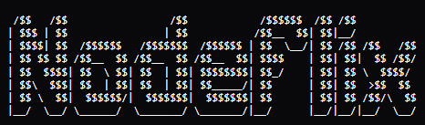
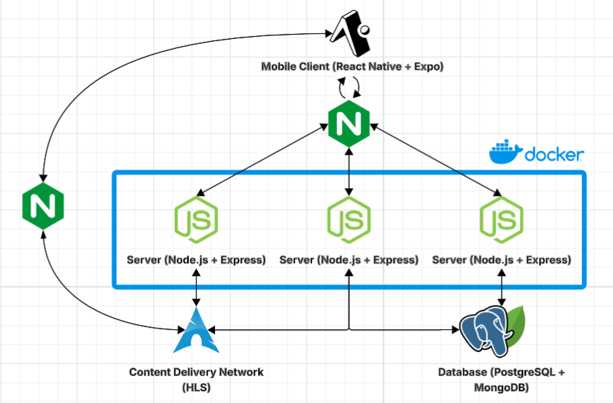

<p align="center">
    
</p>

<p align="center">
    A full-stack streaming platform designed to deliver scalable video content through a distributed architecture, combining a mobile client, backend services, CDN, and hybrid database system.
</p>

<p align="center">
    <a href="#"></a>
    <a href="#"></a>
    <a href="#"></a>
    <a href="#"></a>
</p>

---

## Ecosystem Overview

Nodeflix is composed of four main services:

### [Client](./client/README.md)
A React Native / Expo application providing a responsive, mobile-first interface for content discovery, profile management, and high-quality video playback.

### [Server](./server/README.md)
The core backend engine built with Node.js and Express, handling authentication, business logic, and orchestrating interactions between users and metadata.

### [CDN](./cdn/README.md)
A specialized content distribution network using NGINX and HLS streaming to deliver video segments and media assets efficiently across different network conditions.

### [Database](./db/README.md)
A robust dual-layer storage system combining **PostgreSQL** for relational user data and **MongoDB** for flexible content metadata and analytics.

---

## Architecture

The system follows a distributed architecture to ensure scalability and separation of concerns:

<p align="center">
    
</p>

---

## Project Structure

```bash
nodeflix/
├── client/          # Frontend mobile application (Expo/React Native)
├── server/          # Backend API (Node.js/Express)
├── cdn/             # Content Distribution Network & Media Processing (Nginx)
├── db/              # Database models and configuration (Postgres/MongoDB)
├── docs/            # Project documentation and assets
├── tests/           # End-to-end and integration tests
└── docker-compose.yml
```

---

## Quick Start

The entire ecosystem can be launched using Docker Compose for local development:

#### 1. Configure Environment

Before starting, copy the example environment file and configure it with your settings:

```bash
cp .env.example .env
```

#### 2. Launch Services

```bash
docker compose up -d --build
```

#### 3. Access Services

- Backend: `http://localhost:5000`
- CDN: `http://localhost:80`
- Client: Follow instructions in [client/README.md](./client/README.md)

---

## Testing

Nodeflix features a robust end-to-end and API testing suite implemented with **Playwright**.

### Prerequisites

Before running the tests, ensure that:
1. All backend, database, and CDN services are running (e.g., using `docker compose up -d`).
2. The client web server is running at the address specified by the environment variables (typically `http://localhost:8081/`).
3. Your local `.env` file is properly configured with the test variables:
   - `PLAYWRIGHT_URL` (or `PLAYWRIGHT_PAGE_URL`): The URL where the client is running (default `http://localhost:8081/`).
   - `PLAYWRIGHT_API_URL`: The URL of the API gateway (default `http://localhost:5000/api`).
   - `PLAYWRIGHT_JWT_TOKEN`: A valid JWT bearer token for authenticated API tests.
   - `BYPASS_RATELIMIT_SECRET`: The rate-limit bypass key matching the backend configuration.

>[!WARNING] JWT TOKEN needs to be retrieved manually with a HTTP request!

### Running Tests

We provide scripts in the root `package.json` to simplify test execution. You can run them using `npm`:

```bash
# Run all tests headlessly
npm test

# Run tests in UI Mode (with interactive browser and debugger)
npm run test:ui

# Run tests in headed/debug mode
npm run test:debug

# View the HTML report of the last test execution
npm run test:report
```

To run a specific test file or directory, use:
```bash
npx playwright test tests/api/basics.spec.ts
```

---

## License

This project is licensed under the [MIT License](./LICENSE).

---

## Author

Yenterick
