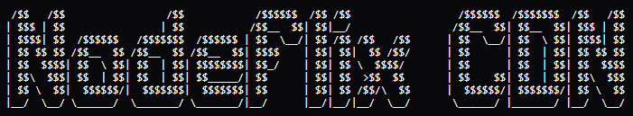
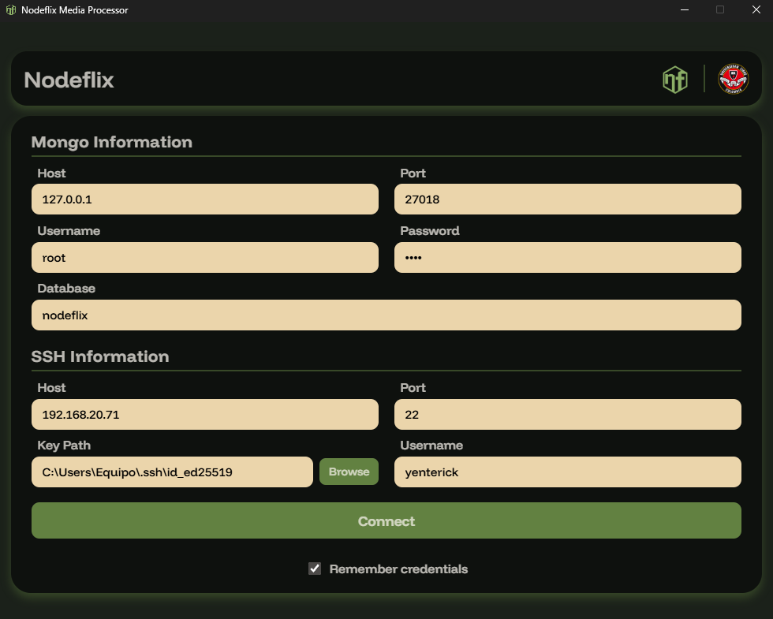

<p align="center">
    
</p>

<p align="center">
    Content distribution network designed to serve multimedia content to the 'Nodeflix' streaming application.
</p>

<p align="center">
    <a href="#"></a>
    <a href="#"></a>
    <a href="#"></a>
    <a href="#"></a>
    <a href="#"></a>
    <a href="#"></a>
</p>

---

These are all the files needed to convert and deliver content for NodeFlix.
All videos are in m3u8 (HLS) format to reduce the load on the client when downloading them, allowing for segmented streaming.
All the images are in jpeg format.

> [!NOTE]
> This setup is intended exclusively for Nodeflix and is tailored to its content structure and workflow.

---

## Quick Start

### Configuration

Before starting, copy the example environment file and configure it with your settings:

```bash
cp .env.example .env
```

## NGINX Setup

Follow these steps to install and configure NGINX for Nodeflix CDN.

#### 1. Install NGINX

On your server, install NGINX:

**Ubuntu / Debian:**
```bash
sudo apt update
sudo apt install nginx -y
```

**Fedora:**

```bash
sudo dnf install nginx -y
```

**Arch:**

```bash
sudo pacman -S nginx
```

#### 2. Enable and start NGINX

```bash
sudo systemctl enable nginx
sudo systemctl start nginx
```

Check status:

```bash
sudo systemctl status nginx
```

#### 3. Create your CDN directory

This is where your processed content will be stored:

```bash
sudo mkdir -p /var/www/hls/
sudo chown -R 777 /var/www/
```

#### 4. Configure NGINX

Open the default config file:

```bash
sudo nano /etc/nginx/nginx.conf
```

#### 5. Add your CDN configuration

Setup:

```nginx
worker_processes auto;

events {
    worker_connections 128;
}

http {
    
    include mime.types;

    server {
        listen 80;

        location / {
            root /var/www/hls/;
        }
    }
}

```

> File available on the project folder

#### 6. Test configuration

```bash
sudo nginx -t
```

#### 7. Restart NGINX

```bash
sudo systemctl restart nginx
```

---

## SSH Setup
<span style="color: rgba(0, 0, 0, 0.5);">(Skip if you have SSH keys already configured).</span>

#### 1. Generate SSH key (on client)

Run this on your local machine:

```bash
ssh-keygen -t ed25519 -C "nodeflix-cdn"
```

Press Enter to use the default path:

```bash
~/.ssh/id_ed25519
```

#### 2. Copy public key to server

```bash
ssh-copy-id user@your-server-ip
```

If ssh-copy-id is not available:

```bash
cat ~/.ssh/id_ed25519.pub | ssh user@your-server-ip "mkdir ~/.ssh && cat >> ~/.ssh/authorized_keys"
```

#### 3. Set correct permissions (on server)
```bash
chmod 700 ~/.ssh
chmod 600 ~/.ssh/authorized_keys
```

#### 4. Configure SSH server

Edit the SSH config file:

```bash
sudo nano /etc/ssh/sshd_config
```

Make sure these lines exist:

```bash
PubkeyAuthentication yes
AuthorizedKeysFile .ssh/authorized_keys
PasswordAuthentication no
```

#### 5. Restart SSH service

```bash
sudo systemctl restart ssh
```

or:

```bash
sudo systemctl restart sshd
```

#### 6. Test connection

From your local machine:

```bash
ssh user@your-server-ip
```

If everything is correct, it should connect without asking for a password.

#### 7. Setup default profile picture

You must place the following file:

`/var/www/hls/pictures/default/1.jpeg`

This image will be served whenever a user doesn't select a profile picture.

---

# Media Processor Script (Deprecated)

> [!IMPORTANT]
> Profile picture processing is not available via script!

## Directory Layout

```bash
root/
├─ var/
│  ├─ www/
│  │  ├─ uploads/
│  │  │  ├─ movieInput.mp4
│  │  │  ├─ movieThumbnail.jpg
│  │  │  ├─ seriesThumbnail.jpg
│  │  │  ├─ serieInput/
│  │  │  │  ├─ 1/
│  │  │  │  │  ├─ 2.mp4
│  │  │  │  │  ├─ 1.mp4
│  │  │  │  ├─ 2/
│  │  ├─ hls/
│  │  │  ├─ movies/
│  │  │  │  ├─ id/
│  │  │  │  │  ├─ master.m3u8
│  │  │  │  │  ├─ thumbnail.jpeg/
│  │  │  ├─ series/
│  │  │  │  ├─ id/
│  │  │  │  │  ├─ thumbnail.jpeg
│  │  │  │  │  ├─ 1/
│  │  │  │  │  │  ├─ 1/
│  │  │  │  │  │  │  ├─ master.m3u8
│  │  │  │  │  │  │  ├─ thumbnail.jpeg
│  │  │  │  │  │  ├─ 2/
│  │  │  │  │  ├─ 2/
```

--- 

### Entry Append to Database Example

The script uses /var/www/uploads/ as its base.

```bash
node mediaProcessor.js --m --r --i movieInput.mp4 --t movieThumbnail.jpeg
```

#### --Help Flag STDOUT

```bash
Usage: node mediaProcessor.js [options]
Options:
   --v, --version    Show version
   --h, --help       Show this help message
   --m, --movie      Process a movie
   --s, --series     Process a series
   --l, --local      Process local media
   --r, --remote     Process remote media
   Movie Process:
       --i, --input      Input file path
       --t, --thumbnail  Thumbnail file path
   Series Process:
       --i, --input      Input folder path
       --t, --thumbnail  Thumbnail file path
```

---

### FFMPEG Conversion Script Example

```bash
ffmpeg -i input.mp4 -hls_time ${Segment duration} -hls_list_size ${Max quantity of segments} -hls_segment_filename "segment_%03d.ts" -f hls master.m3u8
```

---

### HLS URL Example

`http://server/movies/${id}/master.m3u8`
`http://server/series/${id}/1/1/master.m3u8`

---

# Desktop App (New Version)

## Electron Build

#### 1. Navigate to the app folder

```bash
cd ./app
```

#### 2. Install all the dependencies

```bash
npm install
```

or 

```bash
npm i
```

#### 3. Build the electron app

```bash
npm run dist
```

And wait for the app to finish building, and you will find the installer inside the **/dist** folder.

---

## Processing Content

After installing the app, you can use the user interface:

<p align="center">
    
</p>

> If you check the box to remember credentials, all your information will be saved inside the **%appdata%** folder of your user.

> [!WARNING]
> Remember to use the content processor with care because the process of deleting the server and database will have to be done manually!

---

## License

This project is licensed under the MIT License.

## Author

Yenterick


