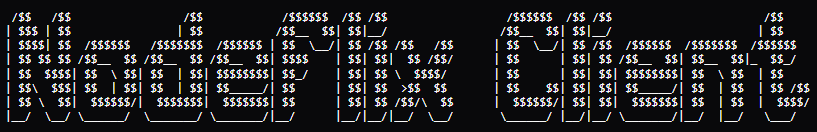

<p align="center">
    
</p>

<p align="center">
    Frontend client responsible for rendering the user interface, handling user interactions, and communicating with backend and CDN services for the 'Nodeflix' streaming application.
</p>

<p align="center">
    <a href="#"></a>
    <a href="#"></a>
    <a href="#"></a>
    <a href="#"></a>
    <a href="#"></a>
    <a href="#"></a>
</p>

---

This client application delivers the full user experience for Nodeflix, including content browsing, profile management, and media playback.

- User authentication and session handling.
- Multi-profile system similar to streaming platforms.
- Browsing movies and series by categories and genres.
- Video playback using HLS streaming via CDN.
- User interactions such as viewing progress and lists.
- Responsive mobile-first interface.

---

## Application

To run the client locally, first configure the environment variables:

```bash
cp .env.example .env
```

Then install the dependencies and start the application:

```bash
npm install
npm start
```

Then open using:

- Expo Go (mobile)
- Android Emulator
- iOS Simulator
- Web Browser

---

## Integration

The client integrates with the system as follows:

- **Backend API** → Handles authentication, metadata, and user interactions.
- **CDN** → Serves video streams, thumbnails, and media assets.

Environment variables are used to configure API endpoints and services.

---

## License

This project is licensed under the MIT License.

## Author

Yenterick