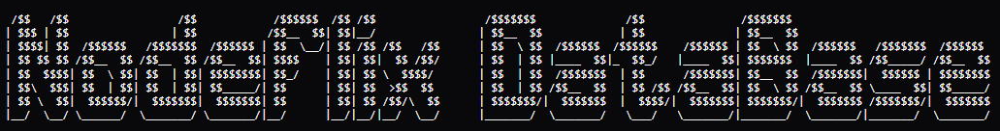
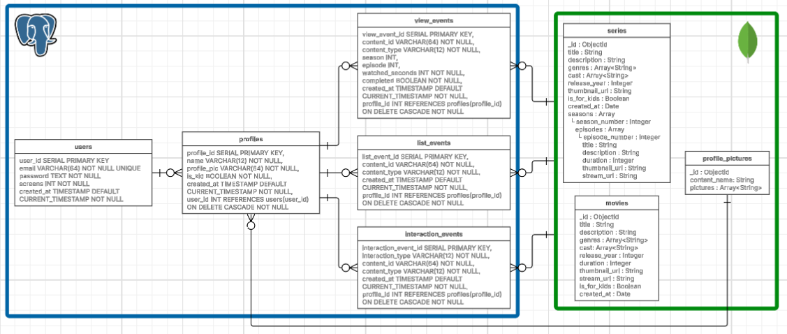

    

    Database layer responsible for storing, organizing, and managing all persistent data for the 'Nodeflix' streaming application.

    
    
    
    
    
    

---

This database system is designed to support all data operations within Nodeflix, combining relational and non-relational approaches:

- PostgreSQL for structured and relational data (users, content, relationships).
- MongoDB for nested data models (movies, series...).
- Optimized data models for streaming platforms.
- Efficient querying and indexing strategies.
- Separation of concerns between transactional and non-transactional data.

---

## Database Architecture

    

---

## Data Responsibilities

### PostgreSQL (Relational Layer)

Handles structured and transactional data:

- **users** → Stores account credentials and basic user configuration.
- **profiles** → Represents individual user profiles (multi-profile system).
- **view_events** → Tracks content consumption (watch time, completion, episodes).
- **interaction_events** → Stores user actions (likes, dislikes).
- **list_events** → Manages user lists and saved content.

---

### MongoDB (Content Layer)

Handles flexible and content-heavy data:

- **movies** → Stores movie metadata including duration, genres, cast, and streaming URLs.
- **series** → Stores series data with nested seasons and episodes.
- **profile_pictures** → Stores available profile images.

---

## License

This project is licensed under the MIT License.

## Author

Yenterick