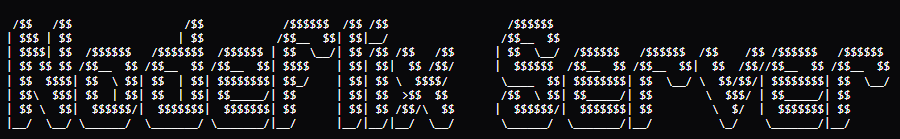

    

    Backend server responsible for handling API requests, business logic, and data management for the 'Nodeflix' streaming application.

    
    
    
    
    
    
    

---

This service provides all the core backend functionality required by Nodeflix, including:

- User management and authentication.
- Content metadata handling (movies, series, genres).
- API endpoints for client applications.
- Integration with the CDN for media delivery.
- Request validation and business logic processing.

Docker support is included to simplify deployment and container customization.

> [!NOTE]
> This setup is intended exclusively for Nodeflix and is tailored to its content structure and workflow.

---

## Application

- Backend API: http://localhost:5000/api 
- API Documentation (Swagger): http://localhost:5000/api/docs
- API Health Check: http://localhost:5000/api/health

---

## License

This project is licensed under the MIT License.

---

## Author

Yenterick
